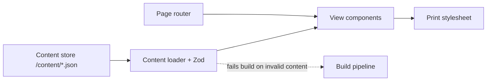

# Architecture Overview — Resume Website

| Field        | Value                        |
| ------------ | ---------------------------- |
| Status       | Active                       |
| Last updated | 2026-05-27                   |
| Related ADRs | ADR-0001, ADR-0002, ADR-0003 |

## 1. System context

A static website. Visitors load pages from a CDN. The owner edits content files
in the repository; pushing to the main branch triggers a build and deploy.

```
[Visitor browser] <--HTTPS--> [Static CDN (Vercel / Cloudflare Pages)]
                                       ^
                                       | build & deploy
                              [Git repository: code + content]
                                       ^
                                       | commits
                                   [Owner]
```

## 2. Components

| Component        | Responsibility                                                               | Owns                       | Depends on                      |
| ---------------- | ---------------------------------------------------------------------------- | -------------------------- | ------------------------------- |
| Content store    | Source-of-truth resume data in JSON files                                    | `/content/*.json`          | —                               |
| Content loader   | Read, validate (Zod), and join content at build time                         | Loading + validation logic | Content store, schemas          |
| Page router      | Next.js App Router pages: home, timelines, skills, education, details, print | Route components           | Content loader, view components |
| View components  | Stateless React components rendering loaded data                             | Presentation only          | Loaded data shapes              |
| Print stylesheet | `@media print` rules + dedicated `/print/*` routes                           | Print layout               | View components                 |
| Build pipeline   | Static export, type-check, schema validation, Lighthouse check               | CI tasks                   | Repo                            |

## 3. Component interactions



## 4. Data flow

A typical page load:

1. At build time, the content loader reads every file under `/content/`.
1. Each file is parsed and validated against its Zod schema. A validation
   failure fails the build with a precise error.
1. Cross-references (Position → Employer, Project → Position, Skill → many) are
   resolved into a fully-joined in-memory graph.
1. Each route component receives the slice of the graph it needs via static
   props (e.g. the unified timeline gets all positions sorted by date).
1. Next.js renders each route to static HTML at build time.
1. The visitor’s browser receives pre-rendered HTML from the CDN.

The `/print/[variant]` routes use the same data graph but a paginated layout and
print-optimized stylesheet.

## 5. Technology stack

| Layer          | Choice                                                        | Rationale (or ADR ref)    |
| -------------- | ------------------------------------------------------------- | ------------------------- |
| Language       | TypeScript (strict mode)                                      | ADR-0001                  |
| Framework      | Next.js (App Router), static export                           | ADR-0001                  |
| Styling        | Tailwind CSS                                                  | ADR-0001                  |
| Content format | JSON files in `/content/`                                     | ADR-0002                  |
| Validation     | Zod schemas, executed at build time                           | ADR-0002                  |
| Hosting        | Vercel or Cloudflare Pages (static)                           | ADR-0001                  |
| Print          | Native browser print + `@media print` CSS + `/print/*` routes | —                         |
| Testing        | Vitest (unit), Playwright (visual + print smoke)              | See Engineering Standards |

## 6. Cross-cutting concerns

- **Authn / authz**: None. Public read-only site.
- **Error handling**: Build-time errors (invalid content) fail the build with
  the file and field that failed validation. Runtime is essentially
  presentation-only and has no failure modes beyond network/CDN.
- **Logging / observability**: Hosting-platform default analytics only. No
  custom logging.
- **Configuration / secrets**: No secrets required for v1. Site config
  (owner name, contact, tagline) lives in `/content/site.json`.
- **Security**: Static output, no user input handling, no forms. Standard
  CSP and security headers via hosting platform.
- **Accessibility**: WCAG 2.1 AA target. Semantic HTML, keyboard navigation,
  reduced-motion respect, sufficient color contrast.
- **Performance**: Static HTML, image optimization via Next.js, no client-side
  data fetching. Target Lighthouse ≥ 95 across the board.

## 7. Architectural constraints & boundaries

- View components never read files or call validators directly — they receive
  already-loaded, already-validated data via props.
- The content loader is the only module that imports from `/content/`.
- A new career track must be addable by extending the `career` enum and adding
  content. No view component may hard-code the list `['software', 'events']`;
  views derive the list from data.
- No runtime database, API, or server functions. If a feature seems to require
  one, it is a candidate for an ADR before adding it.

## 8. Decision log (ADRs)

| ID       | Title                                                     | Status   | Date       |
| -------- | --------------------------------------------------------- | -------- | ---------- |
| ADR-0001 | Tech stack: Next.js + TypeScript + Tailwind               | Accepted | 2026-05-27 |
| ADR-0002 | Content as git-tracked files, validated by Zod            | Accepted | 2026-05-27 |
| ADR-0003 | `Position.career` as the single tag driving all filtering | Accepted | 2026-05-27 |
