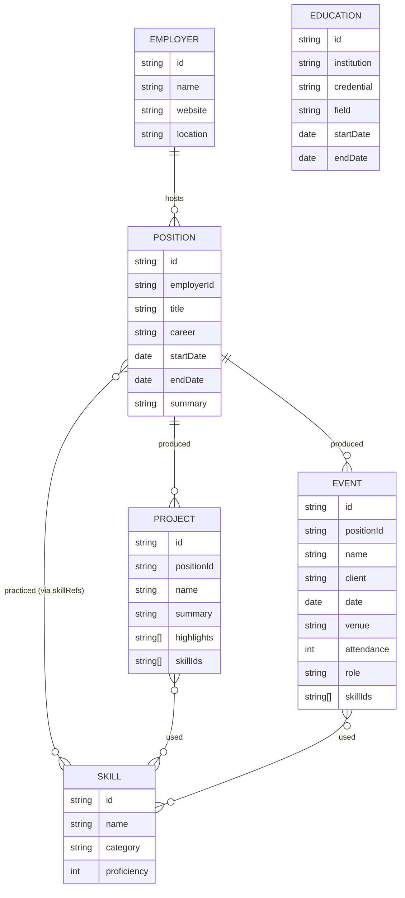

# Domain Model — Resume Website

| Field        | Value      |
| ------------ | ---------- |
| Status       | Active     |
| Last updated | 2026-05-29 |

## 1. Overview

The model describes one person’s professional history across one or more career
tracks. **Employers** host **Positions**; positions are tagged with a `career`
track and produce **Projects** (software-flavored work) or **Events**
(production-flavored work). **Skills** are tagged across the entities where they
were practiced. **Education** is a flat list. **Site** holds top-level config.

## 2. Entity relationship diagram

## 3. Entities

### Site

Top-level site configuration. Exactly one record (in `content/site.json`).

| Attribute    | Type     | Required | Description                                                                                                            | Constraints       |
| ------------ | -------- | -------- | ---------------------------------------------------------------------------------------------------------------------- | ----------------- |
| ownerName    | string   | yes      | Full name displayed on the site                                                                                        | 1–100 chars       |
| tagline      | string   | yes      | Short professional tagline                                                                                             | 1–160 chars       |
| contactEmail | string   | yes      | Public-facing email                                                                                                    | valid email       |
| location     | string   | no       | City / region                                                                                                          |                   |
| socialLinks  | object[] | no       | `{label, url}` entries                                                                                                 | url must be https |
| careers      | object[] | yes      | Configured career tracks (see below)                                                                                   | min 1             |
| siteUrl      | string   | no       | Canonical site URL (e.g. `https://owner.example`). Used for OG/canonical/sitemap. Relative URLs are emitted if absent. | https URL         |
| repoUrl      | string   | no       | Public repository URL surfaced by the SiteFooter's optional "View source" link.                                        | https URL         |
| bookingUrl   | string   | no       | Public scheduling URL (Calendly, Cal.com, etc.) surfaced on `/contact` as a "Book a call" button. Omit to suppress.    | https URL         |

**careers entry**

| Attribute | Type    | Required | Description                                |
| --------- | ------- | -------- | ------------------------------------------ |
| id        | string  | yes      | Machine id, e.g. `software`                |
| label     | string  | yes      | Display label, e.g. `Software Engineering` |
| order     | integer | yes      | Display order in UI                        |

### Employer

A company or organization that hosted one or more positions.

| Attribute   | Type   | Required | Description                          | Constraints        |
| ----------- | ------ | -------- | ------------------------------------ | ------------------ |
| id          | string | yes      | Stable slug, e.g. `acme-corp`        | unique, kebab-case |
| name        | string | yes      | Display name                         | 1–100 chars        |
| website     | string | no       | Public URL                           | https URL          |
| location    | string | no       | City / region                        |                    |
| description | string | no       | One-line description of the employer | ≤ 200 chars        |

**Relationships**: has many `Position`.

**Invariants**: `id` is unique across all employers.

### Position

A held role at an employer over a date range. The canonical unit of work history.

| Attribute  | Type           | Required | Description                          | Constraints                       |
| ---------- | -------------- | -------- | ------------------------------------ | --------------------------------- |
| id         | string         | yes      | Stable slug                          | unique, kebab-case                |
| employerId | string         | yes      | FK to `Employer.id`                  | must exist                        |
| title      | string         | yes      | Job title                            | 1–120 chars                       |
| career     | string         | yes      | Career track id                      | must exist in `Site.careers[].id` |
| startDate  | date (YYYY-MM) | yes      | Month precision                      | ≤ endDate (if set)                |
| endDate    | date (YYYY-MM) | no       | Omitted means current                | ≥ startDate                       |
| summary    | string         | yes      | 1–3 sentence overview                | ≤ 500 chars                       |
| highlights | string[]       | no       | Bullet-point achievements for resume | each ≤ 200 chars                  |
| skillIds   | string[]       | no       | Skills practiced at this position    | each must exist                   |
| location   | string         | no       | Work location                        |                                   |

**Relationships**: belongs to one `Employer`; has many `Project` and/or `Event`.

**Invariants**

- `startDate ≤ endDate` when `endDate` is set.
- At most one position per (employer, track) may be open-ended (`endDate` omitted)
  at a time, with the exception that the current role on each track may be open.
- `career` value must be present in the configured career list.

**Lifecycle / states**

- `current` (endDate omitted) → `past` (endDate set).

### Project

A discrete body of software-flavored work, typically within a Position.

| Attribute         | Type     | Required           | Description                                                                                                                                                                | Constraints        |
| ----------------- | -------- | ------------------ | -------------------------------------------------------------------------------------------------------------------------------------------------------------------------- | ------------------ |
| id                | string   | yes                | Stable slug                                                                                                                                                                | unique, kebab-case |
| positionId        | string   | yes                | FK to `Position.id`                                                                                                                                                        | must exist         |
| name              | string   | yes                | Project name                                                                                                                                                               | 1–120 chars        |
| summary           | string   | yes                | Short description                                                                                                                                                          | ≤ 500 chars        |
| highlights        | string[] | no                 | Achievement bullets                                                                                                                                                        | each ≤ 200 chars   |
| skillIds          | string[] | no                 | Skills used                                                                                                                                                                | each must exist    |
| links             | object[] | no                 | `{label, url}` references                                                                                                                                                  | url https          |
| confidential      | boolean  | no (default false) | If true, mask employer-sensitive detail                                                                                                                                    |                    |
| confidentialLabel | string   | no                 | Generic label shown in place of the employer when `confidential` is true (e.g. "Confidential — Fortune 500 retailer"). Omit to suppress the employer attribution entirely. | 1–120 chars        |

**Relationships**: belongs to one `Position`; references many `Skill`.

**Invariants**: parent Position should typically have `career = software`; not
strictly enforced because cross-track projects are valid in principle.

### Event

A discrete production or operations event, typically within a Position.

| Attribute  | Type              | Required | Description                               | Constraints        |
| ---------- | ----------------- | -------- | ----------------------------------------- | ------------------ |
| id         | string            | yes      | Stable slug                               | unique, kebab-case |
| positionId | string            | yes      | FK to `Position.id`                       | must exist         |
| name       | string            | yes      | Event name                                | 1–160 chars        |
| client     | string            | no       | Visible client (may differ from employer) |                    |
| date       | date (YYYY-MM-DD) | yes      | Event date                                | valid date         |
| venue      | string            | no       | Venue name and city                       |                    |
| attendance | integer           | no       | Approximate headcount                     | ≥ 0                |
| role       | string            | yes      | Owner’s role on the event                 | 1–120 chars        |
| summary    | string            | yes      | Short description                         | ≤ 500 chars        |
| highlights | string[]          | no       | Outcome bullets                           | each ≤ 200 chars   |
| skillIds   | string[]          | no       | Skills used                               | each must exist    |

**Relationships**: belongs to one `Position`; references many `Skill`.

### Skill

A named capability, technical or operational.

| Attribute   | Type    | Required | Description                                                                | Constraints        |
| ----------- | ------- | -------- | -------------------------------------------------------------------------- | ------------------ |
| id          | string  | yes      | Stable slug                                                                | unique, kebab-case |
| name        | string  | yes      | Display name                                                               | 1–80 chars         |
| category    | string  | yes      | Grouping label, e.g. `language`, `framework`, `operations`, `vendor-tools` |                    |
| proficiency | integer | no       | 1–5 self-rating, omit if not rated                                         | 1 ≤ x ≤ 5          |
| description | string  | no       | One-line clarification                                                     | ≤ 200 chars        |

**Relationships**: referenced by many `Position`, `Project`, and `Event` via
`skillIds`. The skills page derives “where practiced” by reverse-resolving these.

**Invariants**: skill ids referenced from any entity must exist in `skills.json`.

### Education

A flat list of educational credentials.

| Attribute   | Type           | Required | Description               | Constraints        |
| ----------- | -------------- | -------- | ------------------------- | ------------------ |
| id          | string         | yes      | Stable slug               | unique, kebab-case |
| institution | string         | yes      | School / program          |                    |
| credential  | string         | yes      | Degree / certificate name |                    |
| field       | string         | no       | Major / focus             |                    |
| startDate   | date (YYYY-MM) | no       |                           |                    |
| endDate     | date (YYYY-MM) | no       |                           |                    |
| highlights  | string[]       | no       | Notable achievements      | each ≤ 200 chars   |

### Now

A single record describing the owner's current focus — the [`/now` page][now-convention]
convention. Stored in `content/now.json` as one object (not an array).

| Attribute   | Type              | Required | Description                                                                        | Constraints      |
| ----------- | ----------------- | -------- | ---------------------------------------------------------------------------------- | ---------------- |
| lastUpdated | date (YYYY-MM-DD) | yes      | When the Now content was last touched. Future-dated values emit a build warning.   | valid day date   |
| body        | string            | yes      | Free-form prose describing current work / learning / priorities. Plain text in v1. | 1–2000 chars     |
| bullets     | string[]          | no       | Optional short list rendered after `body`                                          | each 1–200 chars |

**Relationships**: none. Flat, standalone entity.

**Invariants**: exactly one Now record per site. No cross-references.

[now-convention]: https://nownownow.com/about

## 4. Shared value objects & enums

| Name           | Type        | Allowed values / shape                                                  |
| -------------- | ----------- | ----------------------------------------------------------------------- |
| career         | enum (open) | `software`, `events`, and any future track id defined in `Site.careers` |
| date (month)   | string      | `YYYY-MM`                                                               |
| date (day)     | string      | `YYYY-MM-DD`                                                            |
| skill.category | string      | free-form, but consistent across `skills.json`                          |

## 5. Cross-entity rules

- Every `employerId`, `positionId`, and `skillId` reference must resolve to an
  existing entity. The content loader fails the build on dangling references.
- `Position.career` must match a `Site.careers[].id`.
- Slugs (`id` fields) are immutable once published; renames break inbound links.

## 6. Data retention & privacy

| Entity.field                | Classification       | Retention / handling                                                                  |
| --------------------------- | -------------------- | ------------------------------------------------------------------------------------- |
| Site.contactEmail           | Public               | Displayed publicly; use an address the owner is willing to publish                    |
| Project.confidential = true | Sensitive            | Render with generic employer label; never include client/customer names in highlights |
| Event.client                | Public unless marked | Default public; omit if NDA                                                           |

No personal visitor data is collected or stored.
